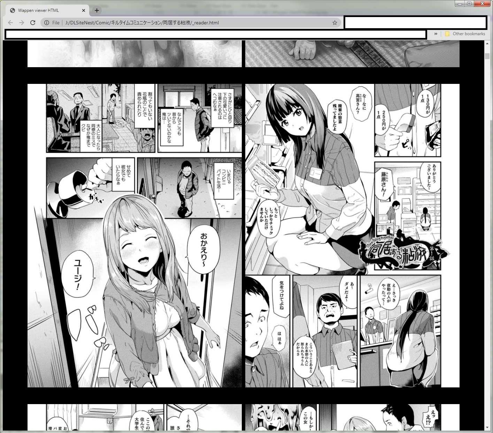

# DLSiteDumper-GUI
This is C# GUI rework of original project https://github.com/typcn/DLSiteDumper.
Dump image from DLSite viewer.

Source based on [K.G from e-hentai forum](https://forums.e-hentai.org/index.php?showtopic=92167&view=findpost&p=2799905)

# Usage

Open EXE file and follow my messy GUI instruction.

# Improvements

* Auto detection of DLSiteViewer.exe process ID
* A GUI, what could you asked more?
* Option to convert to PNG/JPG
* Ability to generate a reader HTML.
 
# Reader HTML

Allows you to choose
* Left to right or Right to left (Manga or comic)
* Image width vs page width (dual view is possible)
* At least viewing experience is better than windows image viewer or DLSiteViewer application.

# Warning

To use this tool you must agree that you are **legitimate buyer of DLSite content**. And only use this for your **personal viewing purpose**, in your own fap cave. Do not share the pirated content or your fap cave will burn down!

# Known problem with DLSiteViewer

* DLSite viewer version that I used will [lockup system when launching new application](https://superuser.com/a/1636040/1099925). This is doing from Cypherguard, the DRM system that it is using, not doing of my program.
* While it is running and loaded a manga, it will start locking the system. The locking goes away if you close it.

# [Download EXE](https://github.com/wappenull/DLSiteDumperGUI/releases/download/v1.1/DLSiteDumperCS.exe)
Now V1.1.
